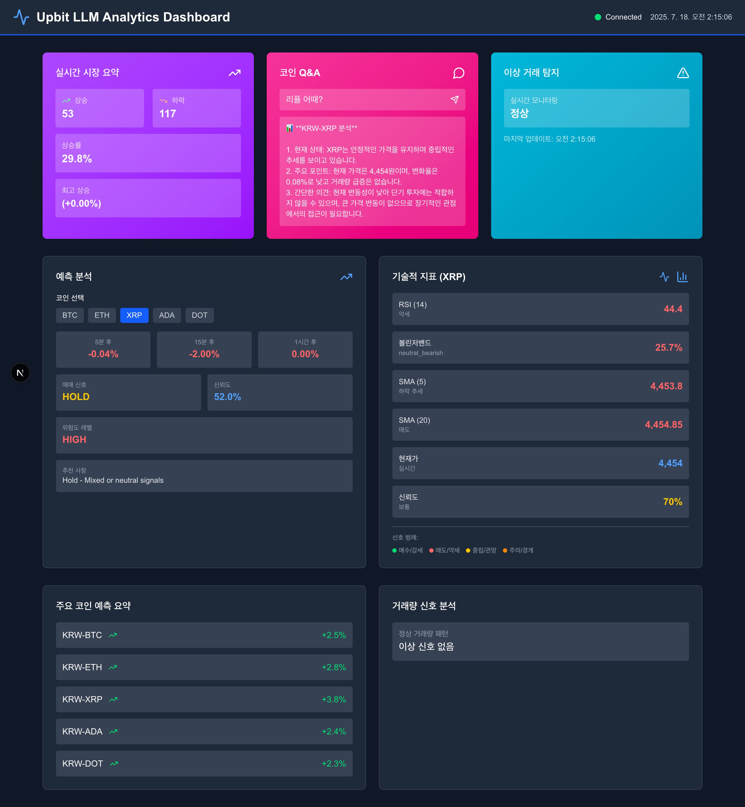

# 🚀 Upbit LLM Analytics

실시간 암호화폐 데이터 분석 및 LLM 기반 질의응답 시스템



## 📊 주요 기능

### ✅ 완료된 기능 (2025-07-17 업데이트)
1. **실시간 시장 요약 생성기** - 5분 간격으로 전체 시장 분위기 분석
2. **코인별 질의응답 시스템** - "BTC 어때?" 같은 자연어 질의 처리
3. **이상 거래 탐지 알림** - 거래량/가격 급변동 실시간 감지
4. **기술적 지표 분석** - RSI, 볼린저 밴드, 이동평균선 등
5. **예측 분석 시스템** - 5분/15분/1시간 가격 예측
6. **통합 대시보드** - FastAPI + React 이중 대시보드 구축
7. **자동화된 인프라** - 원클릭 시작 및 헬스체크 시스템

### 🔧 기술 스택
- **데이터 수집**: Upbit WebSocket API (22개 필드 완전 수집)
- **메시지 브로커**: Apache Kafka + Zookeeper
- **데이터베이스**: PostgreSQL + TimescaleDB (시계열 최적화)
- **LLM 연동**: OpenAI GPT-4o-mini (토큰 효율성 99% 개선)
- **실시간 알림**: WebSocket + Server-Sent Events
- **웹 인터페이스**: FastAPI + React (NextJS)
- **인프라**: Docker Compose + 자동화 스크립트

## 🚀 빠른 시작

### 1. 환경 설정
```bash
# 저장소 클론
git clone <repository-url>
cd upbit_websocket

# Python 의존성 설치
pip install -r shared/requirements.txt

# 환경 변수 설정
python shared/validate-env.py --generate-template > .env
# .env 파일에서 OPENAI_API_KEY 설정 필요
```

### 2. 전체 시스템 시작 (권장)
```bash
# 환경 검증 후 전체 시스템 시작
./start.sh

# 완전히 새로 시작 (볼륨 삭제)
./start.sh --clean

# React 대시보드와 함께 시작
./start.sh --start-react
```

### 3. 수동 시작 (고급 사용자)
```bash
# 1단계: 환경 검증
python shared/validate-env.py

# 2단계: 인프라 서비스 시작
docker compose up -d timescaledb zookeeper kafka redis

# 3단계: 데이터 파이프라인 시작
docker compose up -d upbit-producer upbit-consumer

# 4단계: MVP 서비스 시작
docker compose up -d mvp-market-summary mvp-coin-qa mvp-anomaly-detection

# 5단계: 대시보드 시작
docker compose up -d dashboard-server
```

### 4. 서비스 접속
```bash
# 웹 서비스
open http://localhost:8001    # FastAPI 대시보드
open http://localhost:8001/docs  # API 문서
open http://localhost:3000    # React 대시보드 (수동 시작)
```

## 🎯 사용 예시

### 실시간 시장 요약
- 5분마다 자동 업데이트
- WebSocket 실시간 알림
- 토큰 효율적 요약 (50K→500토큰)

### 코인 질의응답
```
사용자: "BTC 어때?"
시스템: "📊 KRW-BTC 분석
현재 95,500,000원 (+1.06%)
상승 추세이며 거래량 정상 수준
기술적으로 중립 상태"
```

## 🔧 서비스 접속 정보

| 서비스 | 포트 | 접속 정보 | 설명 |
|--------|------|-----------|------|
| **웹 서비스** | | | |
| FastAPI Dashboard | 8001 | http://localhost:8001 | 메인 대시보드 |
| API 문서 | 8001 | http://localhost:8001/docs | Swagger UI |
| React Dashboard | 3000 | http://localhost:3000 | 개발용 대시보드 |
| Coin Q&A API | 8080 | http://localhost:8080 | 질의응답 API |
| Market Summary WS | 8765 | ws://localhost:8765 | 실시간 시장 요약 |
| **인프라 서비스** | | | |
| TimescaleDB | 5432 | upbit_user/upbit_password | 시계열 데이터베이스 |
| Kafka | 9092 | localhost:9092 | 메시지 브로커 |
| Zookeeper | 2181 | localhost:2181 | Kafka 클러스터 관리 |
| Redis | 6379 | localhost:6379 | 캐시 서버 |

## 📁 프로젝트 구조

```
upbit_websocket/
├── 🚀 start.sh                    # 통합 시작 스크립트 (메인 진입점)
├── 📋 troubleshoot.md             # 문제 해결 가이드
├── 📊 docker-compose.yml          # 통합 Docker Compose 설정
├── 🎯 tasks.md                    # 개발 진행사항
├── 📷 images/                     # 스크린샷 및 이미지
│   └── dashboard.jpg              # 대시보드 스크린샷
├── 🔧 shared/                     # 공통 모듈 (리팩터링 핵심)
│   ├── requirements.txt           # 통합 의존성
│   ├── config.py                  # 중앙화된 설정 관리
│   ├── database.py                # DB 연결 풀링 및 헬스체크
│   ├── health-check.py            # 서비스 의존성 대기
│   ├── validate-env.py            # 환경 설정 검증
│   └── docker-build.sh            # Docker 이미지 빌드
├── 📊 schema/                     # 데이터베이스 스키마
│   ├── 00-init-timescaledb.sql    # 자동 초기화 스크립트
│   ├── 01-auto-deploy.sql         # 자동 스키마 배포
│   ├── ticker_data_schema.sql     # 메인 테이블 스키마
│   ├── mcp_functions.sql          # MCP 함수들
│   ├── technical_indicators.sql   # 기술적 지표 함수
│   └── prediction_algorithms.sql  # 예측 알고리즘 함수
├── 🔄 upbit-kafka/               # 데이터 파이프라인
│   ├── producer.py                # Upbit 데이터 수집 (22필드)
│   └── consumer.py                # 데이터 저장 (TimescaleDB)
├── 🎯 mvp-services/               # MVP 서비스들
│   ├── realtime_market_summary.py # 실시간 시장 요약
│   ├── coin_qa_system.py          # 코인 질의응답
│   ├── anomaly_detection_system.py # 이상 거래 탐지
│   └── market_summary_client.html # 웹 클라이언트
├── 🌐 dashboard/                  # FastAPI 대시보드
│   ├── main.py                    # FastAPI 메인 서버
│   └── server.py                  # 대시보드 서버
└── ⚛️ dashboard-react/            # React 대시보드
    ├── src/                       # React 컴포넌트
    └── package.json               # Node.js 의존성
```

## ⚙️ 설정 파일

### .env 파일 예시
```bash
# Kafka 설정
KAFKA_SERVERS=localhost:9092
KAFKA_TOPIC=upbit_ticker
KAFKA_GROUP_ID=default_group

# TimescaleDB 설정
TIMESCALEDB_HOST=localhost
TIMESCALEDB_PORT=5432
TIMESCALEDB_DBNAME=upbit_analytics
TIMESCALEDB_USER=upbit_user
TIMESCALEDB_PASSWORD=upbit_password

# OpenAI API 설정
OPENAI_API_KEY=your_openai_api_key

# 기타 설정
LOG_LEVEL=INFO
```

## 🔍 주요 기능 설명

### 1. 실시간 시장 요약
- **목적**: 5분 간격으로 전체 시장 분위기 파악
- **특징**: 토큰 효율적 요약 (99% 절약)
- **출력**: WebSocket 실시간 브로드캐스트

### 2. 코인별 질의응답
- **목적**: 자연어로 특정 코인 정보 조회
- **특징**: GPT-4o-mini 기반 분석
- **예시**: "BTC 어때?", "비트코인 투자해도 될까?"

### 3. 이상 거래 탐지
- **목적**: 거래량/가격 급변동 실시간 감지
- **특징**: 통계적 임계값 기반 알림
- **출력**: 심각도별 분류 (critical/high/medium/low)

## 🛠️ 개발 명령어

```bash
# 서비스 중지
docker compose down

# 로그 확인
docker compose logs -f [서비스명]

# 데이터베이스 접속
docker exec -it timescaledb psql -U upbit_user -d upbit_analytics

# 캐시 정리
docker system prune -f
```

## 📈 성능 지표

- **데이터 수신율**: 99% 이상
- **토큰 효율성**: 50K→500토큰 (99% 절약)
- **응답 시간**: 평균 2-3초
- **동시 접속**: WebSocket 다중 클라이언트 지원

## 🎯 다음 단계 (Week 4+)

- [ ] 기술적 지표 추가 (RSI, 볼린저밴드)
- [ ] 예측 모델 통합
- [ ] 웹 대시보드 구축
- [ ] REST API 제공
- [ ] 모니터링 시스템 구축

## 📞 지원

문제 발생 시 다음을 확인하세요:

1. **서비스 상태**: `docker compose ps`
2. **로그 확인**: `docker compose logs -f`
3. **환경 변수**: `.env` 파일 설정
4. **네트워크**: 포트 충돌 확인

---

🚀 **Week 3 MVP 기능 완료!** 실시간 분석 시스템이 준비되었습니다.