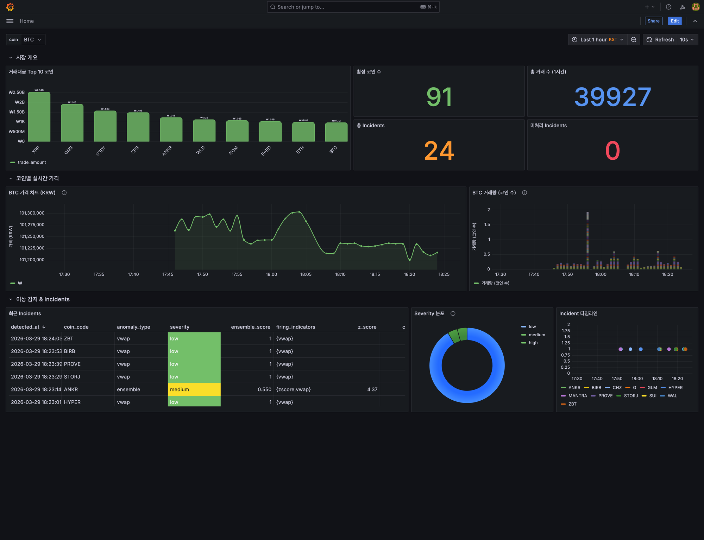
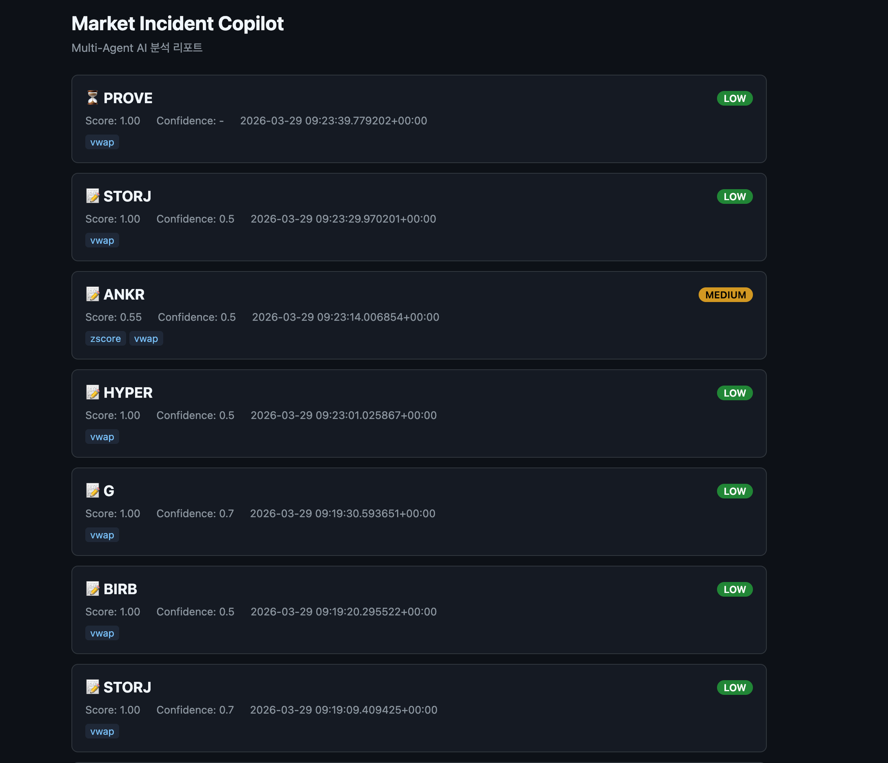
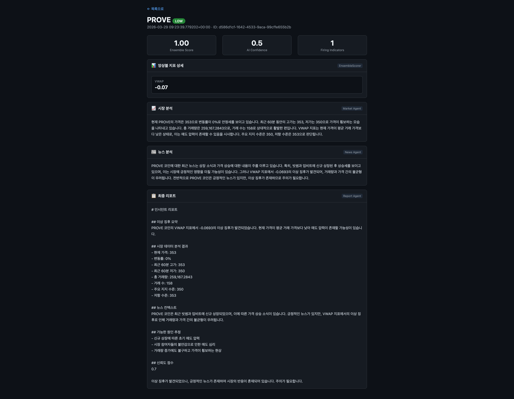
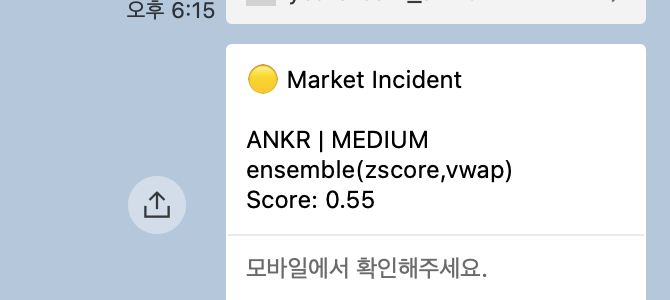

# Coin Anomaly Agent

> **문제**: 암호화폐 시장에서 가격/거래량 급변이 발생해도, 원인 파악에 시간이 걸려 대응이 늦어진다.
>
> **해결**: 실시간 WebSocket 파이프라인 + 4개 지표 앙상블 이상감지 + Multi-Agent AI가 자동으로 원인을 분석한다.
>
> **결과**: 이상 감지부터 시장 분석, 뉴스 검색, 종합 리포트 생성, 알림까지 5분 주기로 자동 동작.



## Features

| | Feature | Description |
|---|---------|-------------|
| **Pipeline** | 실시간 데이터 수집 | Upbit WebSocket -> Kafka -> TimescaleDB |
| **Detection** | 앙상블 이상 감지 | Z-Score, Bollinger Bands, RSI, VWAP 4개 지표 가중치 투표 |
| **AI** | Multi-Agent 분석 | Typed Evidence 패턴 — Pydantic 스키마 + DK-CoT 프롬프트 + 조건부 라우팅 (LangGraph DAG) |
| **Alert** | 멀티 채널 알림 | Telegram + KakaoTalk 동시 지원 |
| **Dashboard** | Grafana 모니터링 | 거래대금 Top 10, 실시간 가격, Z-Score, Incidents |
| **Report** | 리포트 뷰어 | 각 Agent별 응답을 구조화된 HTML로 조회 |
| **API** | REST API | FastAPI 기반 incidents CRUD + Replay mode |

## Screenshots

<table>
<tr>
<td width="50%">

**리포트 목록** (`localhost:8000/reports`)



</td>
<td width="50%">

**리포트 상세** (Agent별 분석 결과)



</td>
</tr>
<tr>
<td width="50%">

**Grafana 대시보드** (`localhost:3001`)


</td>
<td width="50%">

**KakaoTalk 알림**



</td>
</tr>
</table>

## Architecture

```
Upbit WebSocket
       |
       v
  [ Producer ] ----> [ Kafka ] ----> [ Consumer ]
                     (KRaft)              |
                                     batch INSERT
                                          v
                                   [ TimescaleDB ]
                                          |
                    +---------------------+---------------------+
                    |                     |                     |
            [ Ensemble Detector ]   [ FastAPI ]          [ Grafana ]
            (Z-Score + BB + RSI     /reports             :3001
             + VWAP)                /incidents
                    |
                    v (이상 감지 시)
            +-------------------+
            | Multi-Agent DAG   |
            | (조건부 라우팅)    |
            |                   |
            | Market    News    |  <- 조건부 병렬
            | Agent     Agent   |     (zscore/BB → 둘 다)
            | (Evidence) (Evidence)   (rsi/vwap → market만)
            |        \  /       |
            |    Report Agent   |  <- fan-in 종합
            |  (IncidentAssessment)
            +--------+----------+
                     |
              +------+------+
              |             |
         [ Telegram ]  [ KakaoTalk ]
```

### Multi-Agent System

LangGraph 기반 Supervisor + Sub-Agent DAG — **Typed Evidence 패턴**:

- **Market Agent**: TimescaleDB OHLCV 조회 → DK-CoT 프롬프트 → `MarketEvidence` JSON 반환
- **News Agent**: CryptoPanic/SerpAPI 뉴스 검색 → `NewsEvidence` JSON 반환
- **Report Agent**: upstream evidence 종합 → `IncidentAssessment` JSON 반환 (DB 저장은 Supervisor가 수행)

각 에이전트는 자유 형식 텍스트가 아닌 **Pydantic 스키마로 검증된 구조화된 JSON**을 반환합니다.

**조건부 라우팅**: 이상치 유형에 따라 실행 경로가 달라집니다.
- `zscore`/`bollinger` firing → Market + News 병렬 실행 (외부 촉매 가능성)
- `rsi`/`vwap`만 firing → Market만 실행 (기술적 이상, 뉴스 불필요)

**프롬프트 엔지니어링**: Domain Knowledge Chain-of-Thought로 업비트 특화 분석 프레임워크를 주입하고, JSON 스키마를 프롬프트에 포함하여 구조화된 출력을 강제합니다.

### Ensemble Anomaly Detection

단일 Z-Score 대신 4개 지표의 앙상블 투표 시스템. IndicatorBase ABC + Registry 패턴으로 새 지표 추가 시 기존 코드 수정 0.

| Indicator | Method | Weight | Anomaly Condition |
|-----------|--------|--------|-------------------|
| Z-Score | 24h rolling mean/std | 0.30 | \|z\| >= 3.0 |
| Bollinger Bands | MA(60) +/- 2 sigma | 0.25 | %B > 1.0 or < 0.0 |
| RSI | 60-period gain/loss | 0.20 | RSI > 75 or < 25 |
| VWAP | volume-weighted avg | 0.25 | deviation > 2% |

가중치 합 >= 0.5 이면 이상 판정. 동시 발화 수로 severity 결정 (1=low, 2=medium, 3=high, 4=critical).

## Quick Start

```bash
# 1. 환경변수 설정
cp .env.example .env
# .env 파일에 OPENAI_API_KEY 입력 (필수), 나머지는 선택

# 2. 전체 시스템 기동
docker compose up -d
```

> [!NOTE]
> Kafka, TimescaleDB, Producer, Consumer, Scheduler, API, Grafana가 한 번에 기동됩니다.
> Scheduler가 5분마다 자동으로 이상 감지 → AI 분석 → 알림을 수행합니다.

## Project Structure

```
src/
├── config.py              # 환경변수, 로깅, DB 설정
├── pipeline/
│   ├── producer.py        # Upbit WebSocket -> Kafka
│   └── consumer.py        # Kafka -> TimescaleDB (batch INSERT)
├── detector/
│   ├── base.py            # IndicatorBase ABC + Registry
│   ├── zscore.py          # Z-Score 지표
│   ├── bollinger.py       # Bollinger Bands 지표
│   ├── rsi.py             # RSI 지표
│   ├── vwap.py            # VWAP 지표
│   └── ensemble.py        # EnsembleScorer + batch scoring
├── agent/
│   ├── graph.py           # Supervisor DAG (조건부 fan-out/fan-in)
│   ├── schemas.py         # Pydantic 스키마 (MarketEvidence, NewsEvidence, IncidentAssessment)
│   ├── prompts.py         # DK-CoT + JSON 강제 프롬프트 템플릿
│   ├── market_agent.py    # Market Analyst Agent
│   ├── news_agent.py      # News Analyst Agent
│   ├── report_agent.py    # Report Writer Agent
│   └── tools/             # query_market, search_news, write_report
├── api/
│   └── main.py            # FastAPI + HTML 리포트 뷰어
├── alerts/
│   ├── telegram.py        # Telegram Bot 알림
│   └── kakao.py           # KakaoTalk 나에게 보내기
└── scheduler.py           # APScheduler (5분 polling)
```

## Tech Stack

| Category | Technology |
|----------|-----------|
| Streaming | Upbit WebSocket, Kafka (KRaft) |
| Storage | TimescaleDB (hypertable + continuous aggregates) |
| Detection | 4-indicator ensemble (Z-Score, BB, RSI, VWAP) |
| AI Agent | LangGraph Multi-Agent DAG, Pydantic Typed Evidence, GPT-4o-mini |
| Alert | Telegram Bot, KakaoTalk |
| API | FastAPI |
| Dashboard | Grafana |
| Infra | Docker Compose |
| Test | pytest (110+ tests) |

## API Endpoints

| Method | Path | Description |
|--------|------|-------------|
| GET | `/reports` | 리포트 목록 (HTML) |
| GET | `/reports/{id}` | 리포트 상세 - Agent별 분석 (HTML) |
| GET | `/incidents` | Incident 목록 (JSON) |
| GET | `/incidents/{id}` | Incident 상세 (JSON) |
| POST | `/replay` | 과거 시점 이상 감지 재실행 |
| GET | `/docs` | Swagger UI |

## Testing

```bash
pip install -r requirements.txt
python3 -m pytest tests/ -v
# 110 passed
```

## Environment Variables

`cp .env.example .env` 후 필요한 값을 입력하세요.

> [!CAUTION]
> `.env` 파일은 절대 커밋하지 마세요 (`.gitignore`에 이미 포함). PR이나 이슈에 토큰을 올리지 마세요.

| Variable | Required | Description | 설정 시 활성화 |
|----------|----------|-------------|----------------|
| `OPENAI_API_KEY` | Yes | GPT-4o-mini API 키 | Multi-Agent AI 분석 |
| `SERPAPI_API_KEY` | No | 뉴스 검색 API (월 100회 무료) | News Agent 뉴스 검색 |
| `CRYPTOPANIC_API_KEY` | No | 크립토 뉴스 API (무료 tier) | News Agent 크립토 전문 뉴스 |
| `TELEGRAM_BOT_TOKEN` | No | Telegram 봇 토큰 | Telegram 알림 |
| `TELEGRAM_CHAT_ID` | No | Telegram 채팅 ID | Telegram 알림 |
| `KAKAO_REST_API_KEY` | No | Kakao Developers REST API 키 | KakaoTalk 알림 |
| `KAKAO_ACCESS_TOKEN` | No | Kakao OAuth access token | KakaoTalk 알림 |
| `KAKAO_REFRESH_TOKEN` | No | Kakao OAuth refresh token | KakaoTalk 토큰 자동 갱신 |

## KakaoTalk 알림 설정

카카오톡 "나에게 보내기"로 이상 감지 알림을 받을 수 있습니다 (severity medium 이상).

### 1. Kakao Developers 앱 등록

[Kakao Developers](https://developers.kakao.com/) 접속 -> 앱 생성 -> REST API 키 복사

### 2. 카카오 로그인 설정

- **카카오 로그인** 활성화 ON
- **동의항목** -> `talk_message` 선택 동의
- **Redirect URI**: `https://localhost:3000/callback`

### 3. 토큰 발급

**Step 1)** 브라우저에서 아래 URL을 열고 카카오 로그인 + 동의:

```
https://kauth.kakao.com/oauth/authorize?client_id={REST_API_KEY}&redirect_uri=https://localhost:3000/callback&response_type=code&scope=talk_message
```

**Step 2)** "사이트에 연결할 수 없음" 페이지가 뜨면 정상. **URL 바**에서 `code=` 뒤의 값을 복사:

```
https://localhost:3000/callback?code=여기가_인가코드
```

**Step 3)** 터미널에서 토큰 발급:

```bash
curl -X POST https://kauth.kakao.com/oauth/token \
  -d "grant_type=authorization_code" \
  -d "client_id={REST_API_KEY}" \
  -d "redirect_uri=https://localhost:3000/callback" \
  -d "code={위에서_복사한_인가코드}"
```

**Step 4)** 응답 JSON에서 `access_token`과 `refresh_token`을 복사하여 `.env`에 입력:

```env
KAKAO_REST_API_KEY=your_key
KAKAO_ACCESS_TOKEN=응답의_access_token_값
KAKAO_REFRESH_TOKEN=응답의_refresh_token_값
```

> [!TIP]
> `access_token`은 6시간마다 만료되지만, 시스템이 `refresh_token`으로 자동 갱신합니다.
> `refresh_token`은 2개월 유효. 만료 시 Step 1부터 다시 수행합니다.

> [!WARNING]
> 토큰은 반드시 `.env` 파일에만 보관하세요. 코드, 커밋 메시지, PR, 이슈에 토큰을 노출하지 마세요.
> 토큰이 유출된 경우 [Kakao Developers](https://developers.kakao.com/) > 내 애플리케이션 > 앱 키에서 즉시 재발급하세요.
