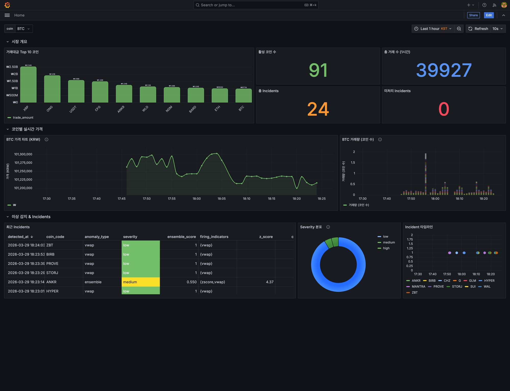
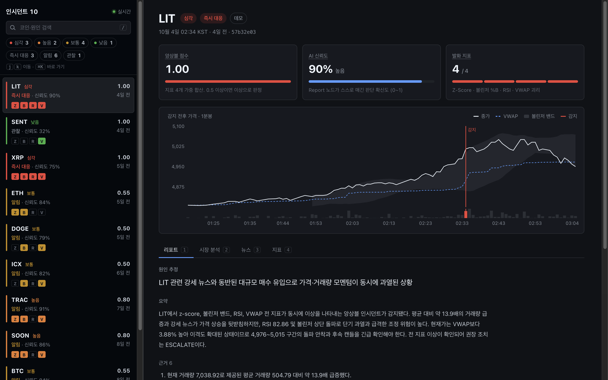
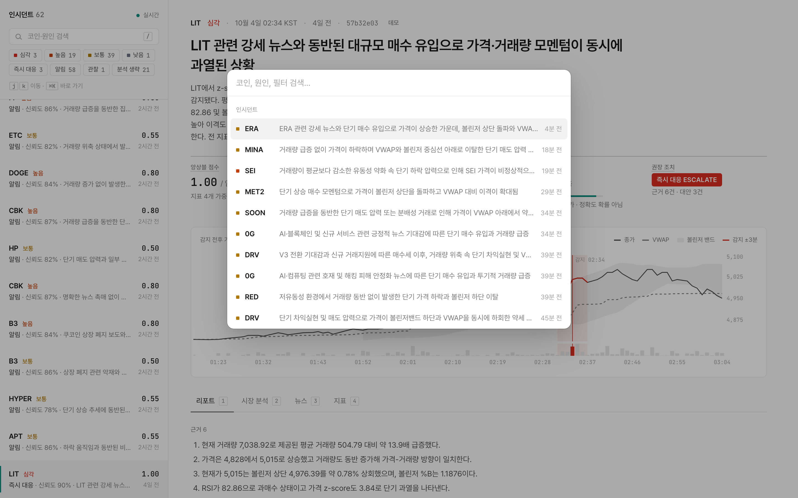
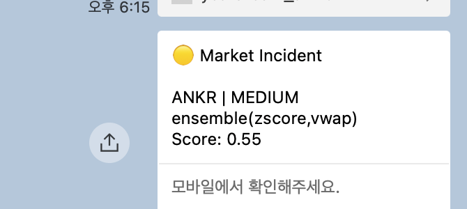
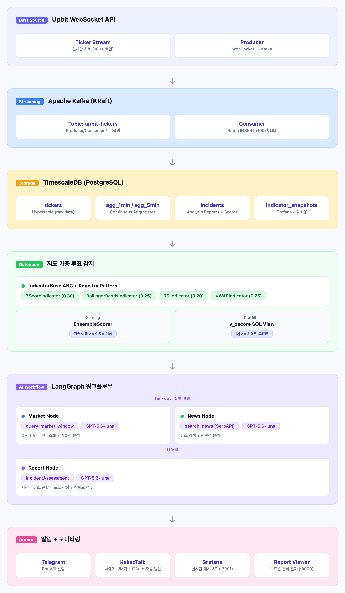
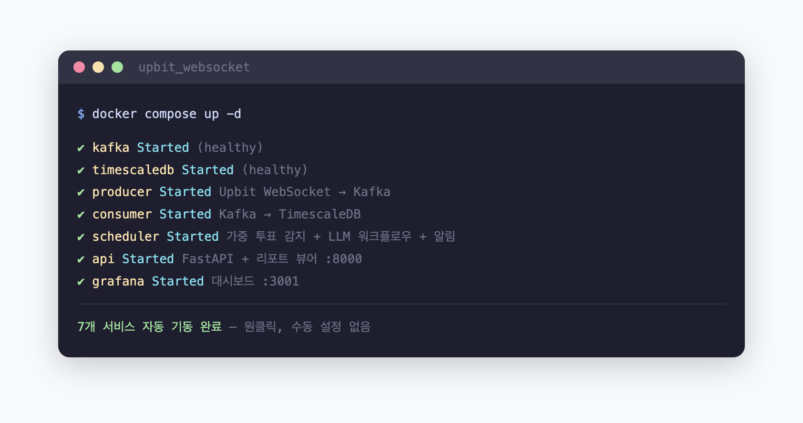

# Coin Anomaly Agent

> **문제**: 암호화폐 시장에서 가격/거래량 급변이 발생해도, 원인 파악에 시간이 걸려 대응이 늦어진다.
>
> **해결**: 실시간 WebSocket 파이프라인 + 4개 지표 가중 투표 이상감지 + 구조화 LLM 워크플로우가 자동으로 원인을 분석한다.
>
> **결과**: 이상 감지부터 시장 분석, 뉴스 검색, 종합 리포트 생성, 알림까지 5분 주기로 자동 동작.



## Features

| | Feature | Description |
|---|---------|-------------|
| **Pipeline** | 실시간 데이터 수집 | Upbit WebSocket -> Kafka -> TimescaleDB |
| **Detection** | 다중 지표 이상 감지 | Z-Score, Bollinger Bands, RSI, VWAP 4개 지표 가중 투표 (합산 점수 기준) |
| **AI** | 구조화 LLM 분석 | OpenAI Structured Outputs로 Pydantic 스키마 강제 + 도메인 분석 절차(SOP) 프롬프트 + 조건부 라우팅 (LangGraph DAG) |
| **Alert** | 멀티 채널 알림 | Telegram + KakaoTalk 동시 지원 |
| **Dashboard** | Grafana 모니터링 | 거래대금 Top 10, 실시간 가격, Z-Score, Incidents |
| **Report** | 리포트 뷰어 (React SPA) | 에이전트 결론 헤드라인 + 근거 레일(점수→지표→뉴스→신뢰도→조치), 감지 전후 1분봉 차트(VWAP·볼린저), 5초 폴링 실시간 갱신·토스트, 필터·검색·⌘K, 키보드 탐색. 디자인 기준은 `DESIGN.md` |
| **API** | REST API | FastAPI 기반 incidents CRUD + Replay mode |

## Screenshots



> 리포트 뷰어(`:8000/app`) — 왼쪽 인시던트 목록(j/k 이동, 심각도·권장 조치 필터), 오른쪽은 "판정서" 순서로 읽힌다: LLM 에이전트의 결론 한 줄 → 근거 레일(앙상블 점수·발화 지표·뉴스·AI 신뢰도·권장 조치, LangGraph 노드 순서) → 감지 ±3분만 색을 입힌 가격 차트 → 심층 탭. 라이트 기본, OS 다크 모드 자동. 새 인시던트는 5초 폴링으로 목록 맨 위에 끼어들고 토스트로 알린다.

| ⌘K 바로 가기 | KakaoTalk 알림 |
|---|---|
|  |  |

> 상단 Grafana 대시보드(`:3001`)는 거래대금 Top 10, 실시간 가격·거래량, 최근 Incidents 테이블, severity 분포, Incident 타임라인을 한 화면에 보여줍니다.

## Architecture



### Weighted Voting Detection

단일 Z-Score 대신 4개 지표의 가중 투표. IndicatorBase ABC + Registry 패턴이라 새 지표는 **클래스 1개 + 등록 1줄**로 추가한다.

| Indicator | Method | Weight | Anomaly Condition |
|-----------|--------|--------|-------------------|
| Z-Score | 24h rolling mean/std | 0.30 | \|z\| >= 3.0 |
| Bollinger Bands | MA(60) +/- 2 sigma | 0.25 | %B > 1.0 or < 0.0 |
| RSI | 60-period gain/loss | 0.20 | RSI > 75 or < 25 |
| VWAP | volume-weighted avg | 0.25 | deviation > 2% |

가중치 합 >= 0.5 이면 이상 판정. 동시 발화 수로 severity 결정 (1=low, 2=medium, 3=high, 4=critical).

### Structured LLM Workflow

LangGraph 조건부 fan-out/fan-in DAG. Market/News 노드가 각각 `MarketEvidence`/`NewsEvidence`를 만들고, Report 노드가 이를 종합해 `IncidentAssessment`를 낸다.

- **스키마 강제**: `with_structured_output(..., method="json_schema")`로 OpenAI Structured Outputs API 층에서 스키마를 강제한다. 프롬프트로 형식을 부탁한 뒤 사후 검증하는 것이 아니라, 모델이 스키마를 벗어난 응답을 애초에 생성할 수 없다.
- **조건부 라우팅**: `zscore`/`bollinger` firing → Market + News 병렬 (외부 촉매 가능성) / `rsi`/`vwap`만 firing → Market만 (기술적 이상, 뉴스 불필요)
- **프롬프트 엔지니어링**: 업비트 특화 분석 절차(SOP)를 프롬프트에 주입한다 — 거래량 맥락 → 가격 액션 → 지지/저항 → 추세 순으로 판단하게 한다. 출력 형식은 스키마가 강제하므로 프롬프트는 **분석 방법에만** 집중한다.

## Quick Start



```bash
cp .env.example .env    # OPENAI_API_KEY 입력 (필수), 나머지는 선택
docker compose up -d
```

> [!NOTE]
> Kafka, TimescaleDB, Producer, Consumer, Scheduler, API, Grafana가 한 번에 기동됩니다.
> Scheduler가 5분마다 이상 감지 → AI 분석 → 알림을 수행합니다.

| | URL |
|---|---|
| 리포트 뷰어 | http://localhost:8000/app |
| Grafana | http://localhost:3001 |
| Swagger UI | http://localhost:8000/docs |

## Tech Stack

| Category | Technology |
|----------|-----------|
| Streaming | Upbit WebSocket, Kafka (KRaft) |
| Storage | TimescaleDB (hypertable + continuous aggregates) |
| Detection | 4-indicator weighted voting (Z-Score, BB, RSI, VWAP) |
| AI Analysis | LangGraph conditional DAG, OpenAI Structured Outputs (Pydantic) |
| Alert | Telegram Bot, KakaoTalk |
| API / Dashboard | FastAPI, Grafana |
| Report Viewer | React 19 + Vite, TanStack Query, recharts, base-ui, cmdk, Sonner, motion, NumberFlow |
| Infra / Test | Docker Compose, pytest (244 tests) |

## API Endpoints

| Method | Path | Description |
|--------|------|-------------|
| GET | `/app` | 리포트 뷰어 (React SPA, `frontend/dist`) |
| GET | `/api/incidents` | 뷰어용 목록 — 노드 출력을 파싱해 권장 조치·신뢰도·원인을 평평하게 |
| GET | `/api/incidents/{id}` | 뷰어용 상세 — 시장·뉴스·리포트 노드 출력 + 지표 |
| GET | `/api/incidents/{id}/candles` | 감지 전후 1분봉 + VWAP·볼린저 밴드 |
| GET | `/reports` | 리포트 목록 (서버 렌더 HTML, 구버전) |
| GET | `/incidents` | Incident 목록 (JSON) |
| GET | `/incidents/{id}` | Incident 상세 (JSON) |
| POST | `/replay` | 과거 시점 이상 감지 재실행 |
| GET | `/docs` | Swagger UI |

<details>
<summary><b>Project Structure</b></summary>

```
src/
├── config.py              # 환경변수, 로깅, DB 설정
├── pipeline/
│   ├── producer.py        # Upbit WebSocket -> Kafka
│   └── consumer.py        # Kafka -> TimescaleDB (batch INSERT)
├── detector/
│   ├── base.py            # IndicatorBase ABC + Registry
│   ├── zscore.py          # Z-Score 지표
│   ├── bollinger.py       # Bollinger Bands 지표
│   ├── rsi.py             # RSI 지표
│   ├── vwap.py            # VWAP 지표
│   └── ensemble.py        # EnsembleScorer + batch scoring
├── agent/
│   ├── graph.py           # LangGraph DAG (조건부 fan-out/fan-in)
│   ├── schemas.py         # Pydantic 스키마 (MarketEvidence, NewsEvidence, IncidentAssessment)
│   ├── prompts.py         # 도메인 SOP 프롬프트 템플릿 (형식은 스키마가 강제)
│   ├── market_agent.py    # Market analysis node
│   ├── news_agent.py      # News analysis node
│   ├── report_agent.py    # Report synthesis node
│   └── tools/             # query_market, search_news
├── api/
│   ├── main.py            # FastAPI + HTML 리포트 뷰어(구버전) + SPA 서빙
│   └── web.py             # React 뷰어용 /api 엔드포인트
├── alerts/
│   ├── telegram.py        # Telegram Bot 알림
│   └── kakao.py           # KakaoTalk 나에게 보내기
└── scheduler.py           # APScheduler (5분 polling)
```

</details>

<details>
<summary><b>Environment Variables</b></summary>

`cp .env.example .env` 후 필요한 값을 입력하세요.

> [!CAUTION]
> `.env` 파일은 절대 커밋하지 마세요 (`.gitignore`에 이미 포함). PR이나 이슈에 토큰을 올리지 마세요.

| Variable | Required | Description | 설정 시 활성화 |
|----------|----------|-------------|----------------|
| `OPENAI_API_KEY` | Yes | OpenAI API 키 | 구조화 LLM 분석 |
| `LLM_MODEL` | No | 분석에 쓸 모델 (기본 `gpt-5.6-luna`) | — |
| `SERPAPI_API_KEY` | No | 뉴스 검색 API (월 100회 무료) | News Node 뉴스 검색 |
| `CRYPTOPANIC_API_KEY` | No | 크립토 뉴스 API (무료 tier) | News Node 크립토 전문 뉴스 |
| `TELEGRAM_BOT_TOKEN` | No | Telegram 봇 토큰 | Telegram 알림 |
| `TELEGRAM_CHAT_ID` | No | Telegram 채팅 ID | Telegram 알림 |
| `KAKAO_REST_API_KEY` | No | Kakao Developers REST API 키 | KakaoTalk 알림 |
| `KAKAO_ACCESS_TOKEN` | No | Kakao OAuth access token | KakaoTalk 알림 |
| `KAKAO_REFRESH_TOKEN` | No | Kakao OAuth refresh token | KakaoTalk 토큰 자동 갱신 |

> [!IMPORTANT]
> `LLM_MODEL`을 `gpt-3*`/`gpt-4-*`/`gpt-4`로 바꾸면 langchain이 경고만 남기고 `function_calling`으로 강등해 스키마 강제가 풀립니다.

</details>

## Testing

```bash
uv sync                       # pyproject.toml + uv.lock 기준으로 설치 (테스트 도구 포함)
uv run pytest -q -p no:cacheprovider   # 244 passed
```

## Report Viewer 개발

```bash
# 데모 데이터 — E1 평가셋 10건의 실제 노드 출력을 source='demo' 로 넣는다
DB_HOST=localhost uv run python scripts/seed_demo_incidents.py
DB_HOST=localhost uv run python scripts/seed_demo_incidents.py --drip   # 사례 1건을 지웠다 다시 넣어 감지 → 분석 완료 흐름 재현 (실시간 데모)

# API + 프론트 개발 서버 (Vite 가 /api 를 API 로 프록시)
DB_HOST=localhost uv run uvicorn src.api.main:app --port 8010
cd frontend && pnpm install && pnpm dev       # http://localhost:5173/app/
pnpm build                                     # frontend/dist → API 가 /app 에서 서빙 (Docker 는 Dockerfile.api 에서 빌드)
```

단축키: `j`/`k` 이동 · `1`~`4` 탭 · `/` 검색 · `⌘K` 바로 가기

## Docs

- [KakaoTalk 알림 설정](docs/kakao-setup.md) — Kakao Developers 앱 등록부터 OAuth 토큰 발급까지
